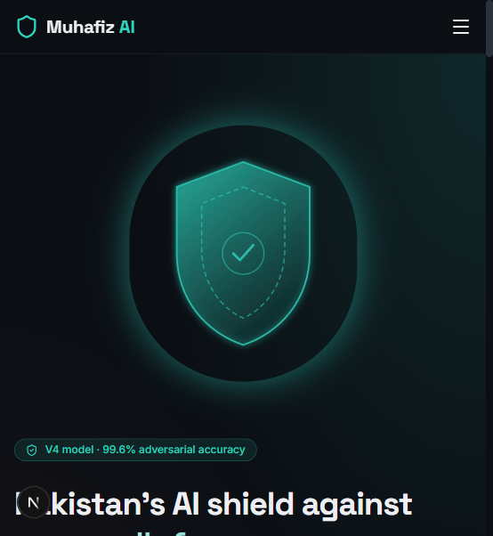
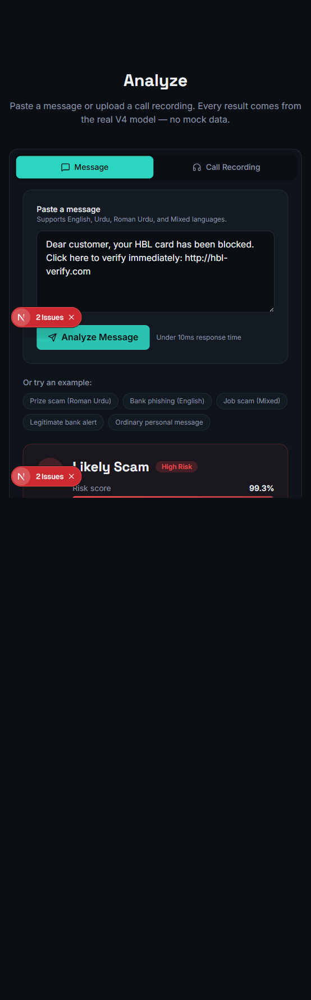
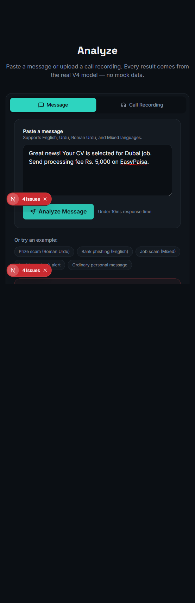
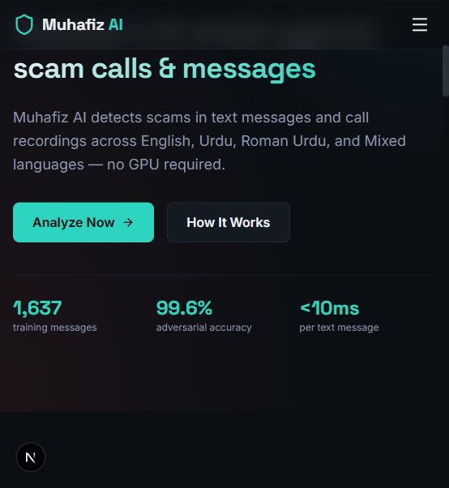
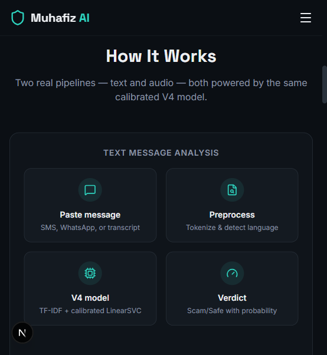
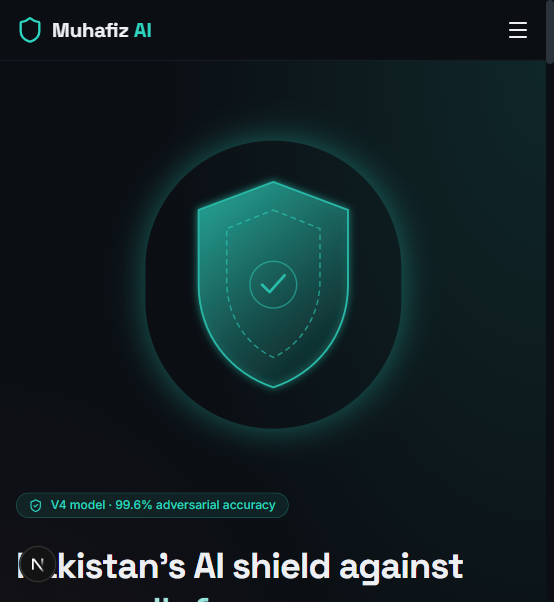

# 🛡️ Muhafiz AI — Scam Detection Shield for Pakistan

**Pakistan's AI shield against scam calls & messages.** AI-powered scam detection for text messages and call recordings — in **English, Urdu, Roman Urdu, and Mixed** languages.


**🌐 Live Site:** [https://muhafiz-ai-six.vercel.app](https://muhafiz-ai-six.vercel.app)

**📂 GitHub Repository:** [https://github.com/saifkhandev/Muhafiz-AI](https://github.com/saifkhandev/Muhafiz-AI)

---

## Table of Contents

- [About](#about)
- [Features](#features)
- [Screenshots](#screenshots)
- [How It Works](#how-it-works)
- [Model Performance](#model-performance)
- [Built With](#built-with)
- [API Reference](#api-reference)
- [Project Structure](#project-structure)
- [Getting Started](#getting-started)
- [Deployment](#deployment)
- [Limitations](#limitations)
- [Roadmap / Future Plans](#roadmap--future-plans)
- [Team](#team)
- [Contact](#contact)
- [Acknowledgments](#acknowledgments)
- [License](#license)

---

## About

### Why it was built

Every day, ordinary Pakistanis lose their savings to scams delivered straight to their phones — fake **BISP/Ehsaas payment notices**, prize-lottery messages demanding a "processing fee", fraudulent overseas **job offers**, bank **phishing links**, fake **SIM-block** threats from "PTA", and callers socially engineering **OTPs** out of their victims.

Pakistan loses billions of rupees annually to phone and message-based fraud. These scams disproportionately target the most vulnerable — the elderly, rural communities, and people with limited digital literacy. Worse, most of these messages are written in **Roman Urdu or Urdu script**, which mainstream international anti-spam tools simply do not understand.

**Muhafiz AI** (Muhafiz = *guardian / protector* in Urdu) was built to close that gap: a **Pakistan-first**, multilingual, accessible first line of defense that anyone can use **before** acting on a suspicious message or call.

### What it is

Muhafiz AI is a full-stack, decision-support web application built for the **Alibaba AI Hackathon — Karachi Regional Round**. It combines a genuinely trained machine-learning model with a modern web experience:

- Paste an **SMS / WhatsApp / chat message** → get an honest Scam/Safe verdict with a calibrated risk score, detected language, transparent scam signals, and a recommended action.
- Upload (or record) a **call recording** → it is transcribed with a local speech-to-text model, every segment is classified individually, and you get a call-level High/Medium/Low risk verdict with a segment-by-segment breakdown showing *exactly which part of the call raised the flag*.

The system runs on a real, trained model (**V4_adversarial_505**) — there is **no mock data and no hardcoded results** anywhere in this project. Every verdict shown in the web app is produced by the real model in real time.

### Who it's for

- **Everyday phone users** who receive a suspicious SMS or WhatsApp message and want a second opinion before clicking a link or sending money
- **Families** who want to protect parents and grandparents from social-engineering fraud
- **Journalists and researchers** tracking scam campaigns in Pakistan
- **Banks, telecoms, and NGOs** looking for an accessible fraud-awareness demo tool

> ⚠️ Muhafiz AI is a **decision-support tool, not a guarantee**. When in doubt, always verify directly with the official organization.

---

## Features

### Text Analysis
- Binary **Scam / Safe** classification with a **calibrated probability** (Platt-scaled via `CalibratedClassifierCV`)
- Risk score (0–100) and Low / Medium / High risk label
- Automatic **language detection** — English, Urdu script, Roman Urdu, Mixed
- **Transparent signal detection** — six rule-based keyword categories (urgency, financial requests, credential/OTP requests, prize/lottery, threats, OTP-specific) clearly labeled as *separate from* the model's own decision
- Context-aware **recommended actions** (e.g. "Do not respond, click links, or share any personal information. Report or block the sender.")
- One-click **example messages** (prize scam, bank phishing, job scam, legitimate bank alert, ordinary personal message)
- Under **10 ms** per message on CPU — no GPU required

### Call Audio Analysis
- Upload common formats (mp3, wav, m4a, webm, aac, ogg, flac) **or record live in the browser** via `MediaRecorder`
- Transcription with **faster-whisper medium** (INT8, CPU) including voice-activity filtering
- **Segment-by-segment breakdown** with timestamps and per-segment scam probabilities
- Aggregated **call-level High / Medium / Low** risk verdict
- Server-side maximum duration enforcement (5 minutes)

### Web Experience
- Interactive **3D wireframe shield** (Three.js) that idles, tilts toward the cursor, and **pulses red or green** in sync with real analysis results
- **Mobile fallback** — static SVG shield with CSS pulse animation below 768px
- **GSAP ScrollTrigger** scroll choreography and an animated pipeline diagram
- **Framer Motion** result animations (scale-in verdict cards, staggered signal chips, sequential segment reveals)
- Dedicated pages: **Home**, **Analyze**, **How It Works**, **Examples**, **Roadmap**
- Fully **responsive** design and honors `prefers-reduced-motion`
- Honest error states — if the backend is unreachable, you see a retryable error, never a fake verdict

---

## Screenshots

| Landing page — interactive 3D shield | Analyze — scam verdict |
|---|---|
|  |  |

| Analyze — job scam example | How It Works — the text pipeline |
|---|---|
|  |  |

| Key stats | Mobile view |
|---|---|
|  |  |

---

## How It Works

### Architecture

```
                Browser (Next.js frontend — Vercel)
                              │
        ┌─────────────────────┴──────────────────────┐
        │  POST /api/analyze-text    POST /api/analyze-audio
        └─────────────────────┬──────────────────────┘
                              │
                  FastAPI backend (Render)
                              │
            ┌─────────────────┴──────────────────┐
            ▼                                  ▼
   V4 Text Model                     faster-whisper (STT)
   TF-IDF (word + char n-grams)      medium model, INT8, CPU
   LinearSVC, calibrated             voice-activity filtering
   decision threshold 0.63                     │
            │                                  ▼
            │                        per-segment V4 classification
            │                                  │
            └────────────► verdict ◄──── aggregated call risk
                                           (High / Medium / Low)
```

### Text pipeline

```
Input message
  → ImprovedScamTextNormalizer (lowercase, USSD normalization, Roman Urdu
    spelling normalization, phrase normalization, number/symbol handling)
  → FeatureUnion
      → Word TF-IDF (ngram_range=1,2, max_features=30000)
      → Char TF-IDF (ngram_range=3,5, analyzer=char_wb, max_features=30000)
  → LinearSVC (C=5.0, class_weight=balanced)
  → Decision function + Platt scaling → calibrated probability
  → Threshold comparison (0.63) → Scam / Safe
```

The preprocessing stage is scam-aware and Pakistan-specific:
- **USSD normalization:** `*786#` → `<USSD_CODE>` token
- **Roman Urdu spelling:** `btayen→batayein`, `krwayen→karwaen`, `kmaen→kamaen` (15+ rules)
- **Phrase normalization:** `k badle→ke badle`, `k sath→ke saath`, `k liye→ke liye` (10+ rules)
- **Number cleanup:** spaced/zero-padded phone numbers normalized
- **URL/Email masking:** prevents the model from memorizing specific URLs

### Audio pipeline

```
Audio input (.aac, .wav, .mp3, .ogg, ...)
  → pydub decode
  → Speech-to-Text (faster-whisper medium, INT8, CPU)
  → Transcript segments (with timestamps)
  → Filler filtering & segment merging
  → predict_message() for each segment
  → Weighted aggregation (max_prob=0.35, weighted_mean=0.35, scam_ratio=0.30)
  → Call-level risk score (High ≥0.60 / Medium ≥0.35 / Low <0.35)
```

### Why these technology choices

- **TF-IDF + LinearSVC instead of a transformer:** chosen deliberately for speed (<10 ms per message on CPU), tiny deployment footprint (~3 MB model), and interpretability — the whole system runs on a laptop or a free-tier cloud instance without a GPU.
- **Calibrated probabilities:** `CalibratedClassifierCV` (Platt scaling) turns raw SVM decision values into a meaningful 0–1 confidence score used for the risk meter.
- **Local Whisper instead of a cloud STT API:** audio never leaves the server, there are no per-call API costs, and it works offline.
- **Honest evaluation:** test sets were kept untouched; contamination was audited; results below lead with verified scores, not inflated ones.

---

## Model Performance

**Model:** `V4_adversarial_505` — Combined word(1,2)-gram + char(3,5)-gram TF-IDF with LinearSVC (C=5.0), wrapped in `CalibratedClassifierCV` (Platt scaling) · **Decision threshold:** 0.63 (optimized for a balanced F1 + F2 + Specificity composite) · **Training data:** 1,637 messages (879 scam, 758 safe) in English, Roman Urdu, Urdu, and Mixed.

### Primary results (untouched test sets)

| Test Suite | Messages | Accuracy | Recall | Precision | FPR | FP | FN |
|---|---|---|---|---|---|---|---|
| Adversarial (V4 integration set) | 505 | **99.60%** | 99.61% | 99.61% | 0.40% | 1 | 1 |
| Fresh holdout (never seen) | 100 | **94.00%** | 90.00% | 97.80% | 2.00% | 1 | 5 |
| Blind test | 50 | **98.00%** | 96.00% | 100% | 0.00% | 0 | 1 |
| Hard test V4 | 56 | **98.21%** | 100% | 96.55% | 3.57% | 1 | 0 |
| BISP diagnostic | 10 | **100.0%** | 100% | 100% | 0.00% | 0 | 0 |
| All-4 external (multilingual) | 318 | **97.48%** | 96.52% | 98.23% | 0.63% | 1 | 7 |
| Real-world samples | 43 | **93.02%** | 87.50% | 100% | 0.00% | 0 | 3 |

### Language-specific results (505-message adversarial test)

| Language | Samples | Accuracy |
|---|---|---|
| English | 178 | **100.0%** |
| Roman Urdu / Mixed | 317 | **99.4%** |
| Urdu (script) | 10 | **100.0%** |

### Speed

| Operation | Latency |
|---|---|
| Text classification | < 10 ms per message |
| Audio call analysis | 23–35 s per call (dominated by transcription) |

### Dataset composition

The training corpus was built and expanded iteratively across model versions:

| Source | Scam | Safe | Total |
|---|---|---|---|
| Original Pakistan-focused dataset | 442 | 426 | 868 |
| V3 augmentation (hard negatives) | 173 | 82 | 255 |
| V4 adversarial expansion | 255 | 250 | 505 |
| **Combined (after dedup)** | **879** | **758** | **1,637** |

It covers **10+ scam categories** common in Pakistan: job scams, lottery/prize draws, bank phishing, OTP extraction, fake SIM-block threats, investment/Ponzi schemes, fake charities, impersonation, advance-fee loans, government-program fraud (BISP, Ehsaas, NADRA, FBR), and fake tech support.

The V4 adversarial expansion specifically targeted false positives — cutting them **48 → 1** on the adversarial test set (a 48× improvement) — by adding 250 safe messages that mirror common false-positive triggers (legit bank deductions, genuine security notices, service OTPs).

### Overfitting check

- Cross-validation accuracy: 99.15% · Test accuracy: 97.33% · Gap: −1.82% (excellent, < 3%)
- Random seed **42** for all splits and training; group-aware, leakage-safe splitting; verified zero train/test overlap

---

## Built With

### Languages
- **TypeScript** — frontend application code
- **Python 3.12+** — backend, ML training, and inference code
- **CSS** — Tailwind-based styling with a custom design system

### Frontend (`scam_detection/web`)
- **[Next.js 16](https://nextjs.org/)** (App Router, Turbopack) — framework
- **[React 19](https://react.dev/)** — UI library
- **[TypeScript 5](https://www.typescriptlang.org/)** — type safety
- **[Tailwind CSS 4](https://tailwindcss.com/)** — design system (dark theme, exact brand palette)
- **[Three.js](https://threejs.org/)** + **@react-three/fiber** + **@react-three/drei** — interactive 3D wireframe shield
- **[GSAP](https://gsap.com/) + ScrollTrigger** — scroll choreography and the animated pipeline diagram
- **[Framer Motion 13](https://www.framer.com/motion/)** — result card, signal chip, and segment animations
- **[lucide-react](https://lucide.dev/)** — iconography
- Fonts: **Space Grotesk** (headings), **Inter** (body), **Noto Nastaliq Urdu** (Urdu script, RTL) — via `next/font`

### Backend (`scam_detection/api`)
- **[FastAPI](https://fastapi.tiangolo.com/)** + **Uvicorn** — REST API server
- **pydantic** — request/response validation
- **python-multipart** — file uploads
- **pydub** — audio decoding/export

### Machine Learning (`scam_detection/src`)
- **[scikit-learn](https://scikit-learn.org/)** — TF-IDF vectorizers, LinearSVC, CalibratedClassifierCV, evaluation
- **joblib** — model artifact persistence
- **[faster-whisper](https://github.com/SYSTRAN/faster-whisper)** — Whisper medium speech-to-text (CTranslate2, INT8, CPU)
- **pandas / NumPy / openpyxl** — dataset preparation
- **matplotlib / seaborn** — analysis charts during development

### APIs
- A self-built **REST API** (FastAPI): `GET /api/health`, `POST /api/analyze-text`, `POST /api/analyze-audio` — full reference [below](#api-reference)
- **No external paid APIs** — the STT model and the classifier both run locally; the web app only talks to its own backend

### Tooling & Hosting
- **Git + GitHub** — version control and auto-deploys on push
- **[Vercel](https://vercel.com/)** — frontend hosting
- **[Render](https://render.com/)** — backend hosting (Python web service)
- **npm / pip + venv** — package management
- *(Optional)* **FFmpeg** — only for exotic audio formats; common formats work without it

---

## API Reference

Base URL: the deployed Render service (see [Deployment](#deployment)) — locally `http://localhost:8000`.

### `GET /api/health`
```json
{
  "status": "ok",
  "model": "V4_adversarial_505",
  "threshold": 0.63,
  "stt": "faster-whisper",
  "audioEnabled": true
}
```

### `POST /api/analyze-text`
Request: `{ "text": "Bhai aap ko Rs. 50,000 ka inaam mila hai..." }`
```json
{
  "verdict": "Scam",
  "riskScore": 99.99,
  "riskLabel": "High",
  "detectedLanguage": "Roman Urdu",
  "signals": [
    { "category": "Financial request", "matchedTerms": ["rs.", "fee"] },
    { "category": "Prize / lottery", "matchedTerms": ["inaam"] }
  ],
  "recommendedAction": "Do not respond, click links, or share any personal information. Report or block the sender.",
  "modelName": "V4_adversarial_505",
  "thresholdUsed": 0.63
}
```

### `POST /api/analyze-audio` (multipart field: `audio`)
```json
{
  "overallRisk": "Low",
  "riskScore": 2.5,
  "callDurationSeconds": 6.6,
  "totalSegments": 2,
  "skippedSegments": 0,
  "transcriptionModel": "faster-whisper",
  "languageDetected": "en",
  "segments": [
    { "text": "Hello, your resume has been approved.", "startTime": 0.3, "endTime": 3.0, "label": "Safe", "scamProbability": 3.8 },
    { "text": "Please add me on WhatsApp.", "startTime": 3.0, "endTime": 5.2, "label": "Safe", "scamProbability": 2.8 }
  ]
}
```

### Python usage (no API)
```python
from src.predict import predict_message, load_model

artifacts, le, threshold, metadata = load_model()

result = predict_message(
    "Aap ko Rs. 50,000 ka inaam mila hai. Fee Rs. 3,000 bhejein.",
    artifacts=artifacts, le=le, threshold=threshold, metadata=metadata,
)
print(result["label"])             # "Scam"
print(result["scam_probability"])  # 0.82
```

---

## Project Structure

```
Muhafiz-AI/
├── LICENSE
├── README.md
├── screenshots/                      # Screenshots used in this README
├── START-WEBSITE.bat                 # One-double-click local launcher (backend + frontend)
└── scam_detection/
    ├── api/
    │   └── main.py                   # FastAPI backend — real model endpoints
    ├── src/
    │   ├── config.py                 # Configuration constants
    │   ├── preprocessing.py          # Scam-aware text normalizer + keyword lexicons
    │   ├── features.py               # Engineered scam-indicator features
    │   ├── train.py                  # Splitting + cross-validation
    │   ├── evaluate.py               # Comparison, thresholds, error analysis
    │   ├── predict.py                # Single-message prediction
    │   ├── transcribe.py             # faster-whisper STT + segment processing
    │   ├── audio.py                  # Audio decoding/export via pydub
    │   ├── call_predict.py           # Call-level aggregation (High/Medium/Low)
    │   └── data_analysis.py          # Data audit + leakage prevention
    ├── models/
    │   ├── full_pipeline.joblib      # Trained V4 model (~3 MB)
    │   ├── label_encoder.joblib
    │   ├── threshold.joblib          # 0.63
    │   ├── model_metadata.joblib
    │   ├── README.md                 # How to fetch the (git-ignored) Whisper model
    │   └── whisper-medium/           # STT model — 1.4 GB, downloaded separately
    ├── data/
    │   ├── scam_messages_dataset.xlsx        # 868-message Pakistan dataset
    │   ├── hard_test_500_for_retrain.json    # V4 adversarial expansion
    │   └── raw/uci_sms_spam/                 # Reference dataset (not used in final model)
    ├── tests/                        # Validation suites (blind, adversarial, holdout...)
    ├── reports/                      # Evaluation reports and metrics
    ├── web/                          # Next.js frontend
    │   └── src/
    │       ├── app/                  # Pages: /, /analyze, /how-it-works, /examples, /roadmap
    │       ├── components/
    │       │   ├── analyzer/         # Text + audio analyzers, result cards, signals
    │       │   ├── shield/           # 3D shield scene + mobile SVG fallback
    │       │   ├── sections/         # Hero, How It Works, Examples, Roadmap
    │       │   └── ui/               # Header, footer, layout
    │       └── lib/                  # API client, TypeScript types, shield pulse context
    ├── requirements.txt
    ├── app.py                        # Legacy Streamlit prototype (superseded by web/)
    └── README.md                     # Detailed ML documentation
```

---

## Getting Started

### Prerequisites
- **Node.js 20+** and npm — [nodejs.org](https://nodejs.org)
- **Python 3.12+** — [python.org](https://python.org)
- **Git** — [git-scm.com](https://git-scm.com)
- *(Optional)* **FFmpeg** — only needed for exotic audio formats; common formats (mp3, wav, m4a, aac, webm) work without it
- For audio analysis: ~2 GB free RAM and the Whisper medium model (see `scam_detection/models/README.md`)

### Installation

```bash
# 1. Clone the repository
git clone https://github.com/saifkhandev/Muhafiz-AI.git
cd Muhafiz-AI/scam_detection

# 2. Backend — create a virtual environment and install dependencies
python -m venv venv
# Windows:
venv\Scripts\activate
# macOS/Linux:
source venv/bin/activate
pip install -r requirements.txt

# 3. (Optional, for audio analysis) download the Whisper medium model
#    → see scam_detection/models/README.md

# 4. Start the backend (loads the V4 model + Whisper once at startup, ~60 s)
python -m uvicorn api.main:app --host 0.0.0.0 --port 8000

# 5. Frontend — in a new terminal
cd web
npm install
npm run dev
# → open http://localhost:3000
```

**Windows shortcut:** double-click `START-WEBSITE.bat` in the repo root — it starts both servers and opens the browser automatically.

### Environment Variables

| Variable | Where | Purpose |
|---|---|---|
| `ENABLE_AUDIO` | Backend | `false` skips loading Whisper (small servers; the audio endpoint returns an honest 503, text analysis stays fully active). Default: `true` |
| `NEXT_PUBLIC_API_URL` | Frontend | Base URL of the backend, e.g. `https://your-api.onrender.com` (no trailing slash). Default: `http://localhost:8000` |

### Build for Production

```bash
# Frontend
cd web
npm run build
npm start          # serves the production build

# Backend
python -m uvicorn api.main:app --host 0.0.0.0 --port 8000 --workers 1
```

> Note: run a **single backend worker** — the model and Whisper are loaded into memory per process (~2 GB with audio enabled).

---

## Deployment

The project deploys as two services:

| Layer | Platform | Root Directory | Key Settings |
|---|---|---|---|
| Frontend | **Vercel** | `scam_detection/web` | Framework: **Next.js** · env `NEXT_PUBLIC_API_URL` = backend URL |
| Backend | **Render** | `scam_detection` | Build: `pip install -r requirements.txt` · Start: `python -m uvicorn api.main:app --host 0.0.0.0 --port $PORT` · env `ENABLE_AUDIO=false` (free tier) |

Every `git push` to `main` auto-redeploys both services.

**Free-tier notes:** Render's free instances sleep after 15 min of inactivity (the first request afterwards takes ~1 min — ping `/api/health` before demos). Audio analysis is disabled on the free tier because Whisper needs ~1.5 GB RAM; the UI shows an honest "unavailable on this server" message, and full audio analysis runs locally via `START-WEBSITE.bat`.

---

## Limitations

We document these honestly — they are deliberate engineering trade-offs, not hidden bugs:

1. **Binary classification only** — the model outputs Scam/Safe. It does *not* tag the scam category (bank, job, BISP, lottery...). Category classification is on the roadmap.
2. **1,637 training messages** — strong for the hackathon scope, small for production scale. Performance may degrade on entirely novel scam templates that don't resemble training data.
3. **Roman Urdu is the hardest case** — despite 15+ spelling-normalization rules, the extreme informality of Roman Urdu ("kya krna ha" vs "kia kerna hy") means edge cases persist; scores are honest but confidence is lower than for English.
4. **Static patterns** — scammers evolve rapidly; the model needs periodic retraining with new scam patterns to stay current.
5. **No transformer benchmark yet** — TF-IDF + SVM was chosen for speed and interpretability; a comparison against mBERT/XLM-R is planned.
6. **The 5 fresh-holdout false negatives** were scam messages deliberately disguised as ordinary legitimate notifications (fake store closure, subscription renewal, real-estate installment reminder, charity confirmation, card-security alert) sitting near the 0.63 decision boundary — a genuinely hard, ambiguous category.
7. **Audio transcription takes 23–35 s on CPU** — honest progress feedback is shown rather than a fake spinner.
8. **Decision support, not a guarantee** — every result screen carries the disclaimer: *"Muhafiz AI is a decision-support tool, not a guarantee. When in doubt, verify directly with the official organization."*

---

## Roadmap / Future Plans

| Feature | Status |
|---|---|
| Binary Scam/Safe text classification | ✅ Shipped (V4) |
| Audio call analysis (STT → segment classification) | ✅ Shipped |
| Multilingual support (EN / Urdu / Roman Urdu / Mixed) | ✅ Shipped |
| Web app with 3D experience + public API | ✅ Shipped |
| **Scam-category classifier** (bank, job, BISP, lottery...) | 🚧 Next — needs a dedicated category-labeled dataset |
| **Live SMS / browser-extension interception** | 🚧 Planned |
| **Continuous learning pipeline** (user reports → periodic retraining) | 🚧 Planned |
| **Transformer comparison** (mBERT / XLM-R vs. TF-IDF + SVM) | 🚧 Planned |
| **Real-time in-call analysis** | 🔭 Exploring |
| **Mobile app** (Android/iOS) | 🔭 Exploring |

---

## Team

Built for the **Alibaba AI Hackathon — Karachi Regional Round**.

- **Amaan** — Machine learning: dataset curation, model training, adversarial evaluation, V4 optimization
- **Saifullah Khan** — Web application: Next.js frontend, FastAPI backend, cloud deployment

---

## Contact

- **GitHub:** [saifkhandev](https://github.com/saifkhandev)
- **LinkedIn:** [Saifullah Khan](https://www.linkedin.com/in/saifkhandev)
- **Instagram:** [@saifkhandev](https://www.instagram.com/saifkhandev)
- **Email:** [saifkhan16.dev@gmail.com](mailto:saifkhan16.dev@gmail.com)

---

## Acknowledgments

- **Alibaba AI Hackathon — Karachi Regional Round** for the challenge and platform
- **[SYSTRAN](https://github.com/SYSTRAN/faster-whisper)** for faster-whisper
- The open-source community behind **scikit-learn, FastAPI, Next.js, React, Three.js, GSAP, Framer Motion, and Tailwind CSS**

---

## License

Released under the **MIT License** — see the [LICENSE](./LICENSE) file for details.
